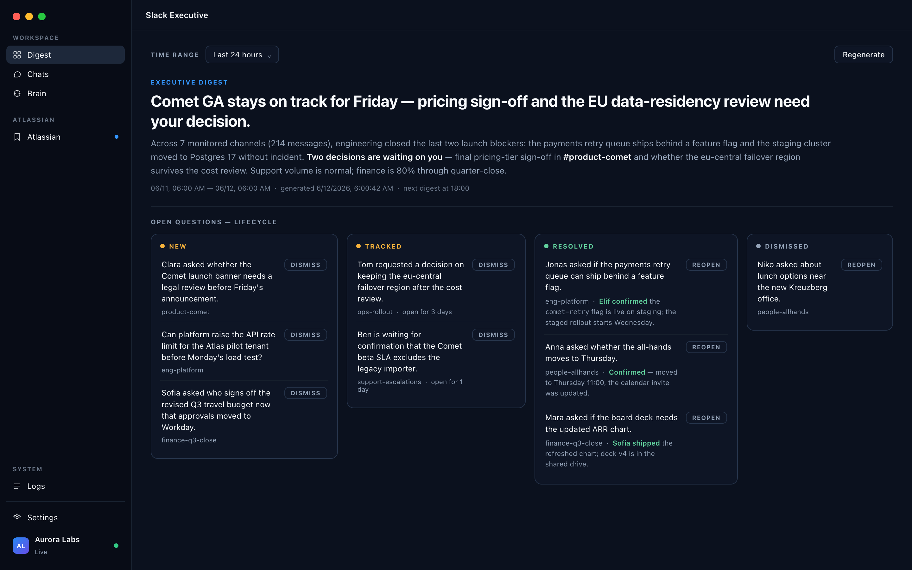
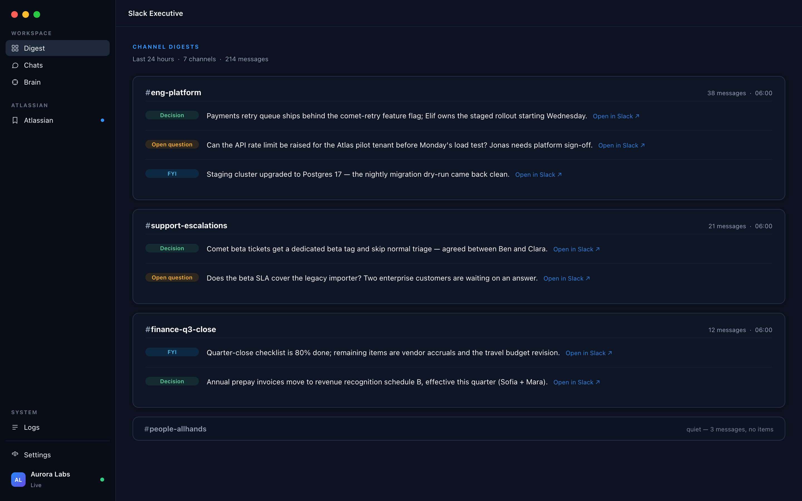
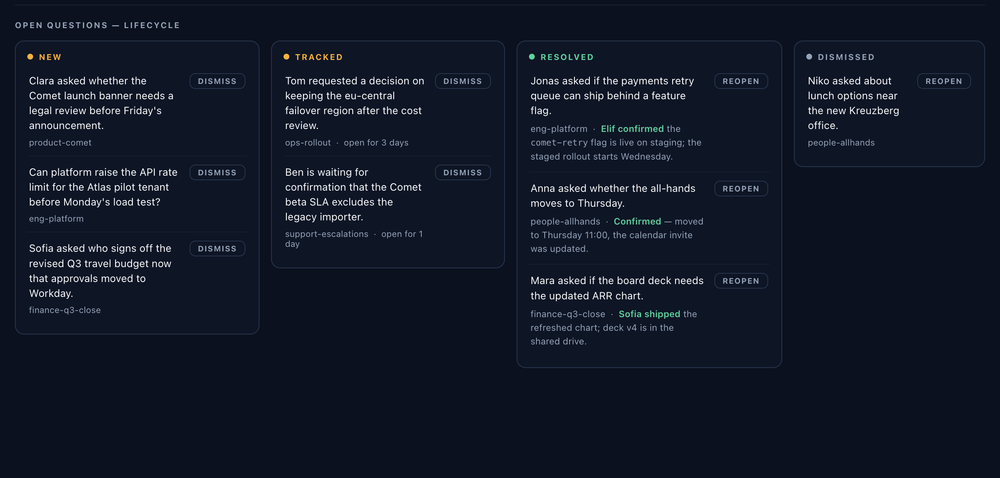
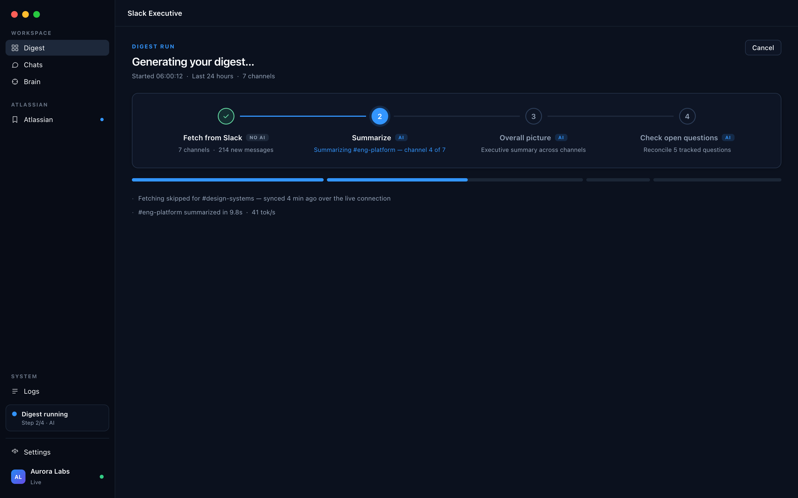
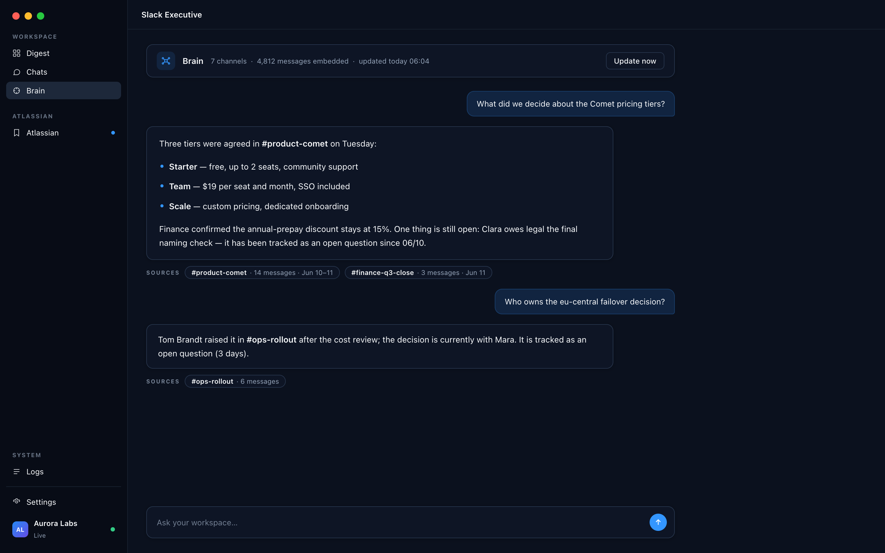
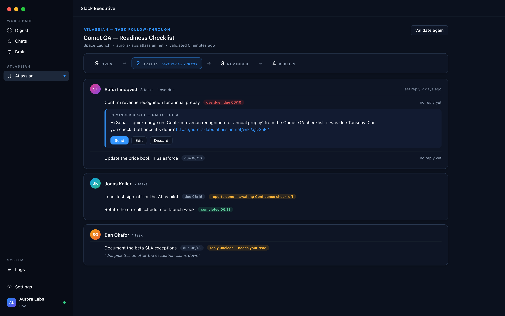
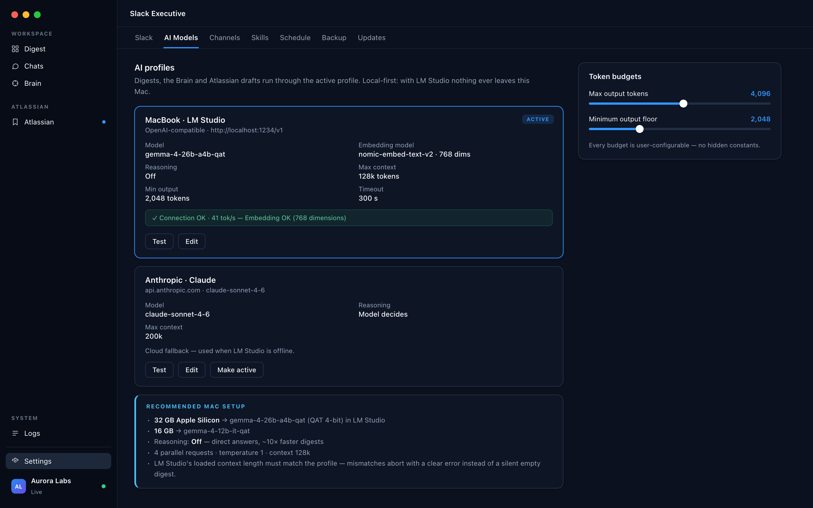
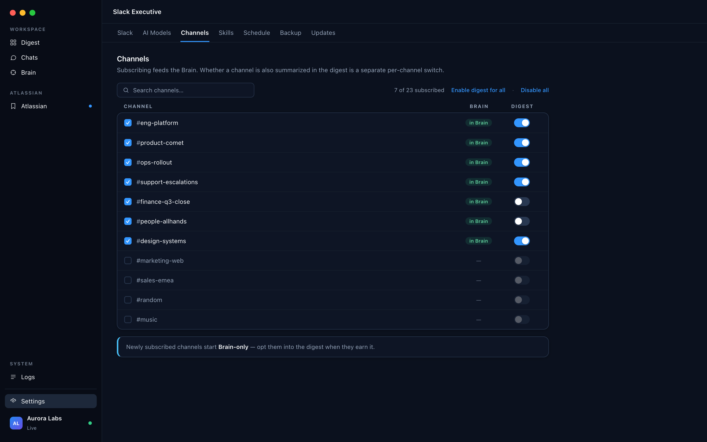

# Slack Executive

### Your Slack, distilled to what matters.

A native macOS app that reads your channels and hands you an **executive digest** —
decisions, open questions, critical updates — on your schedule.
Run it on a **local LLM** and nothing ever leaves your Mac.

**[⬇&nbsp;&nbsp;Download for macOS](https://github.com/diem2001/slack-executive-releases/releases/latest)** &nbsp;·&nbsp;
**[Full tour →](https://diem2001.github.io/slack-executive-releases/)** &nbsp;·&nbsp;
[Changelog](CHANGELOG.md)

 

 

> [!NOTE]
> All screenshots show a **fictional demo workspace** ("Aurora Labs") — no real customer data.

 

## Why Slack Executive

- **Cut through the noise** — hundreds of messages become one briefing: what was decided, what's blocked, what needs you. Color-coded by weight: decisions, open questions, FYI.
- **Nothing falls through** — open questions are tracked as living items across days, until someone actually answers — not until the scrollback swallows them.
- **Your data stays yours** — read-only by design, credentials in the macOS Keychain, and a local-first AI setup: with LM Studio, the model runs on your own machine.

 

## Every channel, distilled to its substance

On your schedule — morning and evening, or whenever you ask — Slack Executive reads each monitored
channel and writes a digest a chief of staff would hand you. Every item carries an
**"Open in Slack"** link to the exact source thread, and an executive summary across channels tells
you in three sentences whether today needs you.

 

## Questions don't dissolve in the scrollback

An unanswered question from Tuesday is still unanswered on Friday — so the app keeps it on the board.
Questions move through **new → tracked → resolved**, with the resolution quoted once someone answers.
Dismiss the noise, reopen anything with one click.

 

## A glass box, not a black box

Every digest run shows its four phases — fetch, summarize, overall picture, open-question check —
with clear AI / no-AI badges and live progress per channel. Channels that are already fresh over the
live connection are skipped instead of re-fetched. Cancel anytime; background runs stay visible from
anywhere in the app.

 

## Ask your workspace anything

The Brain continuously embeds your subscribed channels into a local knowledge base. Ask in plain
language — *"What did we decide about the pricing tiers?"* — and get an answer that **cites its
sources**: channel, message count, date range. Open questions surface right in the answer.

 

## From checklist to checked-off

Point it at a Confluence task page and it closes the loop: it validates who's done what, groups open
tasks by person, and drafts the **reminder DMs** — which you review and send with one click. Replies
are read and classified, but a claim is only an indication: **nothing counts as done until the
checkbox on the page is ticked.**

 

## Your model, your machine, your budget

Run everything on a **local model via LM Studio** — recommended and tuned out of the box — or plug in
Anthropic or any OpenAI-compatible endpoint as a fallback. Reasoning control makes thinking models
answer directly (~10× faster local digests), and every token budget is user-configurable.

 

## You decide what it reads — channel by channel

Subscribing a channel feeds the Brain; whether it also appears in the digest is a separate switch.
New channels start Brain-only. Reconnect a different workspace and the catalog re-scopes itself —
the old workspace's data is kept frozen and returns when you do.

 

## Privacy & trust

Built like it handles your company's nervous system — because it does.

| | |
|---|---|
| 🔑 **Keychain only** | Slack credentials, API keys and cookies live exclusively in the macOS Keychain — never in files, databases, logs or error messages. |
| 👻 **Invisible by default** | The app never emits typing indicators, presence changes or any client-originated visible event. Reading leaves no trace. |
| 📵 **Read-only by design** | The one optional write — marking digested channels as read — is opt-in, narrowly scoped, fully logged, and never touches DMs. |
| 💻 **Local-first AI** | With LM Studio, summaries, the Brain and embeddings are computed on your own hardware. No cloud account required. |
| 🕰️ **Polite traffic** | Activity windows, rate limiting and jitter govern every Slack call. Stealth mode keeps scheduled runs inside working hours. |
| 🧳 **Yours to take** | One backup file carries every setting, credential reference and dataset — restore it on a new Mac and continue where you left off. |

 

## Getting started

1. **Connect your workspace** — one click imports your existing Slack session from Chrome. No password, no bot, no admin approval. Multiple workspaces? Pick one.
2. **Choose your channels** — pick what feeds the Brain and what makes the digest; sensible defaults included.
3. **Get your digest** — run the first one right from onboarding, or let the schedule deliver it morning and evening.

The app is **signed, notarized and keeps itself up to date** via the built-in updater.
English and German UI included.

 

## About this repository

This repo is the **download & update channel** for Slack Executive — the application source lives in a
separate private repository. Each release (tagged `v<version>`) ships:

- `latest.json` — the [Tauri v2 updater manifest](https://v2.tauri.app/plugin/updater/) consumed by the in-app updater.
- `Slack Executive.app.tar.gz` + `.sig` — the notarized, stapled app bundle and its minisign signature; the updater verifies it against the public key baked into the app.
- `*.dmg` — the standalone macOS installer (Developer ID–signed, notarized, stapled).

Latest manifest: `https://github.com/diem2001/slack-executive-releases/releases/latest/download/latest.json`

 

---

© 2026 DiemIT · Slack Executive is an independent product and is not affiliated with, endorsed by,
or sponsored by Slack Technologies / Salesforce or Atlassian. All screenshots show a fictional demo
workspace ("Aurora Labs").
